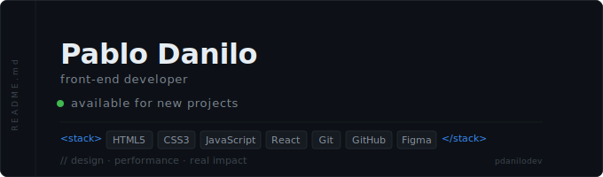

<div align="center">
  
</div>

<br/>

```js
const pablo = {
  role       : "Front-End Developer",
  focus      : ["modern interfaces", "clean design", "best practices"],
  background : ["robotics", "social projects", "tech & education"],
  goal       : "design · performance · real impact",
};
```

<br/>

---

<br/>

```js
const stack = {
  core    : ["HTML5", "CSS3", "JavaScript"],
  tools   : ["React", "Git", "Figma", "Vite"],
  // learning → TypeScript · Next.js
};
```

<br/>

---

<br/>

<div align="center">
  
  &nbsp;&nbsp;
  
</div>

<br/>

---

<br/>

<div align="center">
  <a href="https://linkedin.com/in/SEU-USUARIO">linkedin</a> &nbsp;·&nbsp;
  <a href="https://SEU-PORTFOLIO.com">portfólio</a> &nbsp;·&nbsp;
  <a href="mailto:SEU@EMAIL.com">e-mail</a>
</div>

<br/>

<div align="right">
  <sub><code>// always learning ↑</code></sub>
</div>
